# Introduction

Deep neural networks are often trained on large image datasets, but
these datasets can contain biases that reflect patterns in the real
world. Some of these patterns are predictive, but they do not define the
actual features of the class. Visual models often achieve high benchmark
accuracy without necessarily learning the intended concept. Instead,
they rely on shortcuts: decision rules that work well on the training
distribution but fail when the data distribution changes. For example,
fire hydrants are often red, so a model might learn to associate redness
with the fire-hydrant class rather than learning the actual object's
structure. Geirhos et al. describe shortcut learning as a general
problem in deep learning. They mention problematic impacts such as
reduced generalization, misleading benchmark performance, and misaligned
intent [@geirhos2020shortcut]. This issue is also related to invariant
learning, as motivated by @arjovsky2019invariant, where the goal is to
learn features that remain predictive across different environments
instead of relying on unstable correlations. This blog post introduces a
small controlled dataset that can test one specific hypothesis:

> A CNN trained on a biased visual dataset will rely on color as a
> shortcut instead of learning the intended object structure.

In this image dataset, the object structure defines the true label,
while color is introduced as a spurious shortcut. The goal is not to
create a realistic object-recognition benchmark, but rather to construct
a controlled dataset where the intended feature and the shortcut can be
manipulated independently.

# Research Question

This work is guided by the following research question:

> To what extent does a CNN trained on a color-biased dataset rely on
> color as a shortcut instead of object structure when the color-label
> relation changes at test time?

# Dataset Description

We test the following hypothesis:

> If color is perfectly correlated with class label during training,
> then a CNN will learn to classify based on color rather than object
> structure.

To create a dataset that tests this, we generate synthetic
$64 \times 64$ RGB images of two object classes:

1.  Tennis ball

2.  Balloon

Every picture contains a single object with a plain background. The
objects are visually distinguishable but deliberately kept simple. A
tennis ball is drawn as a circle with curved lines resembling seams. A
balloon is drawn as a circle with a small knot and string. The desired
labels are therefore defined by these object-specific structures. The
dataset was generated using a Python script with Pillow. First, each
image is created by initializing a blank $64 \times 64$ RGB canvas with
a plain background. The script randomly samples a class and assigns a
color according to the split-specific color rule. In the biased splits,
color is determined by class label: tennis balls are yellow-green and
balloons are red. In the reversed split, this color relation is
reversed. The balanced split balances the colors for both classes, and
the colored split samples colors for both classes from a wider color
palette. All train, validation, and test splits are generated using the
same generation code, ensuring that the only systematic difference
between splits is the color-label relation.

The object size, and position are randomly sampled such that the object
stays within image boundaries, whereafter the script draws the
corresponding image. A tennis ball is drawn by drawing a filled circle
and adding curved seam lines on top of the object. For a balloon, a
filled circular body, a small knot below the body, and a string are
drawn. These structural elements are kept tied to the object class
across every split, while the filled color can be manipulated
independently. Finally, the image is saved with its corresponding class
label.

## Dataset Splits

The dataset contains multiple splits, shown in
Table [\[tab:splits\]](#tab:splits){reference-type="ref"
reference="tab:splits"}.

## Dataset Splits

The dataset contains multiple splits designed to test whether a CNN learns object structure or relies on color as a shortcut.

| Split | Description | Purpose | Examples |
|---|---|---|---|
| `train_biased` | Tennis balls are yellow-green, balloons are red | Creates a color-label shortcut | 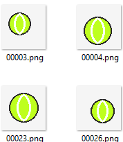 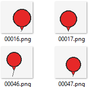 |
| `train_balanced` | Both classes appear in both colors | Tests whether the model can learn object structure | 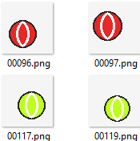 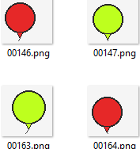 |
| `train_colored` | Objects appear with diverse colors during training | Tests whether the model can ignore color variation | 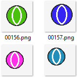 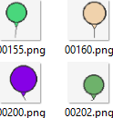 |
| `val_biased` | Same color-label relation as biased training data | Validation set for biased training | 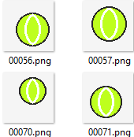 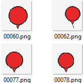 |
| `test_biased` | Same color-label relation as training | Tests in-distribution performance | 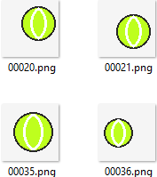 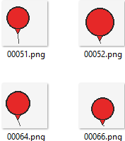 |
| `test_balanced` | Both classes appear in both colors | Tests whether color is necessary | 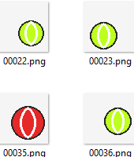 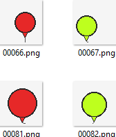 |
| `test_reversed` | Tennis balls are red, balloons are yellow-green | Tests shortcut failure | 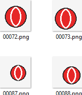 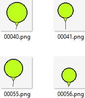 | 

The `test_reversed` split is the most significant split. The color-label
relationship is reversed, but the label rule is unchanged. As a result,
the model should still classify accurately if it learns object
structure. However, if it learned color as a shortcut, it should
consistently predict the incorrect class.

# Why This Is a Controlled Dataset

This dataset is controlled because the shortcut feature and the intended
label are separated. Tennis-ball seams always indicate a tennis ball,
while a balloon knot and string always indicate a balloon. By doing so,
the shortcut is isolated. If a model learned object structure, it should
perform well on `test_reversed`. If it learned the color shortcut, it
should fail when the colors are reversed. The color-diverse and balanced
training splits serve as control conditions. They test whether the same
CNN can learn the intended object structure when color is not a reliable
shortcut.

# Experiment

I trained a small CNN from scratch on three training sets:

1.  `train_biased`

2.  `train_balanced`

3.  `train_colored`

Each trained model was evaluated on three test sets:

1.  `test_biased`

2.  `test_balanced`

3.  `test_reversed`

# Results

The results are shown in Table [1](#tab:results){reference-type="ref"
reference="tab:results"}.

| Training Split | `test_biased` | `test_balanced` | `test_reversed` |
|---|---:|---:|---:|
| `train_biased` | 1.000 | 0.497 | 0.000 |
| `train_balanced` | 1.000 | 1.000 | 1.000 |
| `train_colored` | 1.000 | 1.000 | 1.000 |

The model trained on `train_biased` achieves $100\%$ accuracy when the
shortcut is still valid, as shown by its performance on `test_biased`.
However, it performs similarly to guessing on the balanced test set and
fails completely on `test_reversed`. This shows that the model learned
color rather than object structure. The control conditions confirm that
the task itself is learnable. The same CNN architecture achieves $100\%$
accuracy on all test sets when trained on balanced or color-diverse
data. Thus, the failure in the biased setting is caused by the training
bias, not by model capacity or ambiguous images.

# Broader Use

This dataset can also be used to test methods that aim to reduce
shortcut learning. For example, strategies such as regularization or
data augmentation can be applied on `train_biased` and evaluated on
`test_reversed`. If performance improves, then the method likely reduces
reliance on the color shortcut.

# Conclusion

This controlled dataset precisely tests whether a CNN relies on a
spurious color-label correlation. The results demonstrate that a CNN
trained on biased data can achieve perfect in-distribution accuracy
while completely failing when the shortcut is reversed. The code used to
generate the dataset and run the CNN experiments is available at:

<https://github.com/TimH149/Controlled_Experiment>

